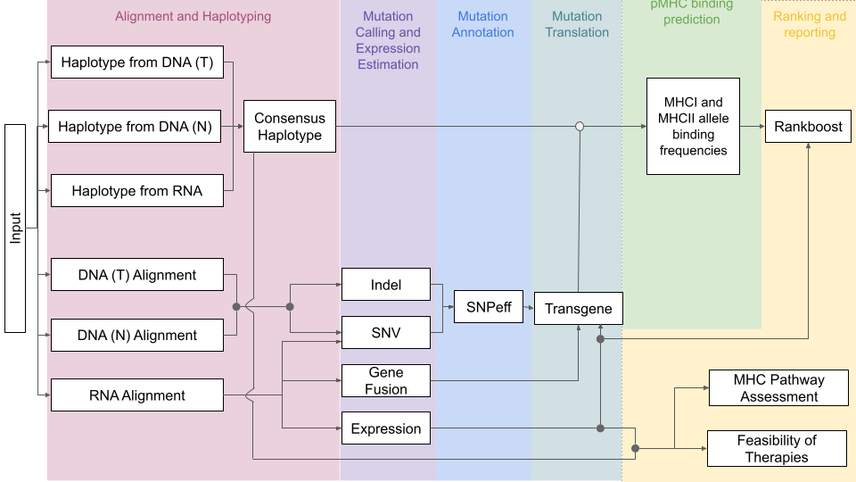

# Introduction 

```{r Library Installation, eval=FALSE}
#only run these if necessary 
if (!requireNamespace("BiocManager", quietly = TRUE))
    install.packages("BiocManager")
BiocManager::install("variants")
```
```{r Libaries}
library(tidyverse)
```


ProTECT normally runs a pipeline including both DNA and RNA. The DNA and RNA are used to:

- compute a consensus haplotype
- call *somatic* (only in the tumor) mutations

These are then used to calculate binding frequencies and look at the rankings of each mutation for potential immunotherapy. 



If we want to run it with only RNA we then need to provide the consensus haplotype from clinician, and call the mutations only from the RNA. 


This results in the changes shown in red. In order to validate this approach we want to confirm that the output of ProTECT when run on the same patient with only RNA rather than with just RNA and DNA is similar. 


# Implementation 

## Running ProTECT with DNA/DNA/RNA

Here we're performing analysis on [DNA and RNA sequencing data from hcc1395](https://github.com/genome/gms/wiki/HCC1395-WGS-Exome-RNA-Seq-Data) [@]. 

```{r eval=FALSE}
dir <- paste(getwd(),"fullbams", sep="/")
seq_data <- c("gerald_D1VCPACXX_6", "gerald_D1VCPACXX_1", "gerald_C1TD1ACXX_8_ACAGTG")
url <- "https://xfer.genome.wustl.edu/gxfer1/project/gms/testdata/bams/hcc1395_1percent"

for(bam in seq_data){ 
  file_loc <- paste0(dir, "/", bam, ".bam")
  if(file.exists(file_loc)){
    print(paste(bam, "exists."))
  }
  else {
    print(paste("Downloading", bam))
    download.file(paste0(url, "/", bam, ".bam"), paste0(dir, "/", bam, ".bam"))
  }
}
```

It was first prepared for a DNA and RNA ProTECT run by seperating in into fastq files using PicardTool's SamToFastq version 2.25.0

```{sh eval=FALSE}
# Normal DNA 
picard SamToFastq -I gerald_D1VCPACXX_6.bam -F gerald_D1VCPACXX_6_R1.fastq --SECOND_END_FASTQ gerald_D1VCPACXX_6_R2.fastq
# Tumor DNA
picard SamToFastq -I /gerald_D1VCPACXX_1.bam -F /gerald_D1VCPACXX_1_R1.fastq --SECOND_END_FASTQ /gerald_D1VCPACXX_1_R2.fastq
# (Tumor) RNA
picard SamToFastq -I gerald_C1TD1ACXX_8_ACAGTG.bam -F gerald_C1TD1ACXX_8_ACAGTG_R1.fastq --SECOND_END_FASTQ gerald_C1TD1ACXX_8_ACAGTG_R2.fastq
```

This could then be directly included into ProTECT's yaml input 

```
patients:
    FULLBAM_NOVAR:
        tumor_dna_fastq_1: `r getwd()`/fullbams/gerald_D1VCPACXX_1_R1.fastq
        tumor_dna_fastq_2: `r getwd()`/fullbams/gerald_D1VCPACXX_1_R2.fastq
        normal_dna_fastq_1: `r getwd()`/fullbams/gerald_D1VCPACXX_6_R1.fastq
        normal_dna_fastq_2: `r getwd()`/fullbams/gerald_D1VCPACXX_6_R2.fastq
        tumor_rna_fastq_1: `r getwd()`/fullbams/gerald_C1TD1ACXX_8_ACAGTG_R1.fastq
        tumor_rna_fastq_2: `r getwd()`/fullbams/gerald_C1TD1ACXX_8_ACAGTG_R2.fastq
        tumor_type: 'SKCM'
```
ProTECT was then run successfully on the DNA and RNA. 

## Running ProTECT with RNA Only
Since our RNA has so many variants, for ProTECT to run effeciently the now aligned RNA bam was then separated into chromosomes: 
```{sh eval=FALSE}
samtools view rna_genome_sorted.bam -b chr${i} > rna_chr${i}.bam
```


### Variant Calling 

Currently we're running with Opossum and Platypus. This may not be best: 

- Platypus stuck in Python2 and development seem to have moved on to [Octopus](https://github.com/luntergroup/octopus) with may be better regardless
- [GATK Best Practices](https://github.com/gatk-workflows/gatk4-rnaseq-germline-snps-indels) also has a suitable workflow without Opossum 

However it's what we've done so far. For the workflow, we run Oppossum and Platypus on each bam file. This is all one big bash file in real life but seperated out, first we set up what we want to get: 

```{sh eval=FALSE}
# YAY INSTALLS 
#yay -S pip samtools htslib

source venv/bin/activate 
# check for RNA Tumor bam 
homedir=$(pwd)
datadir=/scratch/drkthomp/fullbams
DATA=https://xfer.genome.wustl.edu/gxfer1/project/gms/testdata/bams/hcc1395
#RNA_TUMOR_BASE=gerald_C1TD1ACXX_8_ACAGTG
#RNA_TUMOR=/scratch/drkthomp/fullbams/${RNA_TUMOR_BASE}.sorted.bam
for i in {1..2}
do
RNA_TUMOR_BASE=rna_chr${i}
RNA_TUMOR=${datadir}/${RNA_TUMOR_BASE}.bam
#RNA_TUMOR_MD=/scratch/drkthomp/${RNA_TUMOR_BASE}md.bam
RNA_TUMOR_MD=${datadir}/callmd_${RNA_TUMOR_BASE}.bam
RNA_NORMAL=/scratch/drkthomp/fullbams/GCA_000001405.15_GRCh38_no_alt_analysis_set.fna
PICARD=picard.jar 
```

Then we prep for opossum, so grab the picard and normal RNA if we need it, then index the bam. Note that these steps are functionally already done in ProTECT -- ie, we are repeating things (suboptimal, reason to integrate)


```{sh eval=FALSE}
echo "============"
echo "====chr${i}===="
echo "============"

if [ -f "$PICARD" ]; then
      echo "$PICARD exists."
    else
      wget https://github.com/broadinstitute/picard/releases/download/2.23.9/picard.jar $PICARD
fi

if [ -f "$RNA_NORMAL" ]; then
    echo "$RNA_NORMAL exists."
   else
    wget ftp://ftp.ncbi.nlm.nih.gov/genomes/all/GCA/000/001/405/GCA_000001405.15_GRCh38/seqs_for_alignment_pipelines.ucsc_ids/GCA_000001405.15_GRCh38_no_alt_analysis_set.fna.gz ${RNA_NORMAL}.gz 
    gunzip ${RNA_NORMAL}.gz
fi

echo "====CALMD"
if [ -f "$RNA_TUMOR_MD" ]; then
      echo "$RNA_TUMOR_MD exists."
    else 
      samtools calmd ${RNA_TUMOR} ${RNA_NORMAL} > ${RNA_TUMOR_MD}
fi

echo "====INDEX"
if [ -f "${RNA_TUMOR}.bai" ]; then
      echo "${RNA_TUMOR}.bai exists."
    else
      samtools index -b $RNA_TUMOR
      echo "${RNA_TUMOR}.bai created"
fi
```

And then we actually run it: 

```{sh eval=FALSE}

echo "====OPOSSUM"
PROCESSED=${datadir}/opossum_${RNA_TUMOR_BASE}.bam
OPOSSUM=Opossum.py
if [ -f "$OPOSSUM" ]; then 
    echo "$OPOSSUM exists."
  else
    wget -O $OPOSSUM https://raw.githubusercontent.com/BSGOxford/Opossum/master/Opossum.py
    2to3 -w $OPOSSUM 
fi
# pip dependencies for opossum 
pip install pysam 

#woot 
if [ -f "${PROCESSED}" ]; then
    echo "${PROCESSED} exists."
  else
    python $OPOSSUM --BamFile=$RNA_TUMOR --OutFile=$PROCESSED --SoftClipsExist=True 
fi 
```

Then we run Platypus. This is a little bit more difficult and is part of the reason I'm thinking of actually *not* running with Platypus.

```{sh eval=FALSE}
# okay install HTSLib
HTSLIB_TAR=htslib-1.11
if [ -f "${HTSLIB_TAR}.tar.bz2" ]; then
    echo "${HTSLIB_TAR} exists."
  else
    wget -O ${HTSLIB_TAR}.tar.bz2 https://github.com/samtools/htslib/releases/download/1.11/htslib-1.11.tar.bz2
    tar -xf ${HTSLIB_TAR}.tar.bz2
    cd $HTSLIB_TAR
    make install prefix=${homedir}/htslib
    # had to run these manually
fi

echo "====PLATYPUS"
export C_INCLUDE_PATH=${homedir}/htslib/include
export LIBRARY_PATH=${homedir}/htslib/lib
export LD_LIBRARY_PATH=${homedir}/htslib/lib
cd $homedir
PLATYPUS_DIR=platypus
PLATYPUS=${PLATYPUS_DIR}/bin/Platypus.py
if [ -f "$PLATYPUS" ]; then
    echo "$PLATYPUS exists."
  else
    git clone --depth=1 --branch=master https://github.com/andyrimmer/Platypus.git ${PLATYPUS_DIR}
    rm -rf ./${PLATYPUS_DIR}/.git
    cd ${PLATYPUS_DIR}
    make
fi
cd $homedir

#2to3 -w ${PLATYPUS_DIR}/
# first is suggested with opossum
python2 ~/miniconda3/envs/platypus/share/platypus-variant-0.8.1.2-0/Platypus.py callVariants --bamFiles=${PROCESSED} --refFile=${RNA_NORMAL} --filterDuplicates=0 --minMapQual=0 --minFlank=0 --maxReadLength=500 --minGoodQualBases=10 --minBaseQual=25 --output=${datadir}/variants_opossum_${RNA_TUMOR_BASE}.vcf

done 
```

### Variant Filtering 
and then subtract GnomAD from each platypus file: 

```{sh eval=FALSE}
bedtools subtract -header -a variants_opossum_rna_chr${i}.vcf -b /scratch/drkthomp/protect-index/gnomad/gnomad.chr${i}.vcf.gz > variants_chr${i}_subtracted.vcf
```

# Analysis 
```{r Variable Set, echo=FALSE}
baseline <- "FULLBAM_NOVAR"
mainCompare <- "FULLBAM_VARIANTS"
runsToCompare <- c(baseline, mainCompare)
```

## Confirming Matches

We know that the RNA and DNA runs should match at some outputs. 

### Comparing Expressions
```{r Expression Functions, message=FALSE, warning=FALSE, include=FALSE}
getExpression = function(base, fileType) {
  print(paste(
      base,
      "expression",
      paste("rsem", fileType, "results", sep = "."),
      sep = "/"
    ))
  return(arrange_all(read.delim(
    paste(
      base,
      "expression",
      paste("rsem", fileType, "results", sep = "."),
      sep = "/"
    )
  )))
}
```

#### Isoforms
```{r Expression Isoforms, echo=TRUE}
relIsoVals <-
  c("length",
    "effective_length",
    "expected_count",
    "TPM",
    "FPKM",
    "IsoPct")
toRun <-
  parse(text = paste0("getExpression('../", runsToCompare, "', 'isoforms')"))
for (i in seq_along(toRun)){
  assign(paste0("expressionIsoforms.", runsToCompare[i]), eval(toRun[[i]]))
}
  isoforms <- mget(ls(pattern = "^expressionIsoforms.*")) %>%
  bind_rows(.id = "patients") %>% group_by(patients)
isoforms %>%  pivot_wider(names_from = patients, values_from = relIsoVals)
isoforms %>% summarise(
  length = mean(length),
  effective_length = mean(effective_length),
  expected_count = mean(expected_count),
  TPM = mean(TPM),
  FPKM = mean(FPKM),
  IsPct = mean(IsoPct)
)
```

#### Genes
```{r Expression Genes, echo=TRUE}
relGeneVals <-
  c("length", "effective_length", "expected_count", "TPM", "FPKM")
toRun <-
  parse(text = paste0("getExpression('../", runsToCompare, "', 'genes')"))

for (i in seq_along(toRun))
  assign(paste0("expressionGenes.", runsToCompare[i]), eval(toRun[[i]]))
genes <- mget(ls(pattern = "^expressionGenes.*")) %>%
  bind_rows(.id = "patients") %>% group_by(patients)
genes %>% summarise(
  length = mean(length),
  effective_length = mean(effective_length),
  expected_count = mean(expected_count),
  TPM = mean(TPM),
  FPKM = mean(FPKM)
)

```
```{r Expression Cleanup}
rm(genes)
rm(isoforms)
rm(mutations)
rm(expressionGenes.FULLBAM_NOVAR)
rm(expressionIsoforms.FULLBAM_NOVAR)
```

## Variant Comparison 

```{r include=FALSE}
#libraries. may not all be necessary
library(tidyverse)
```

### Getting the VCFs 
```{r}
getVCF = function(name){
  KVsep <- fixed(";")
Vsep <- fixed("=")
filename = paste(name, "vcf",sep=".")
  mutations <- read.delim(filename, header=FALSE, comment.char="#") 
  relevant <- c("CHROM",	"POS",	"ID",	"REF",	"ALT",	"QUAL",	"FILTER",	"INFO")
  names(mutations) <- relevant
  return(mutations[,1:8] %>%
           mutate(mut_id = paste(CHROM, POS, REF, ALT, sep="_")) %>%
           mutate(rn = row_number()) %>%
  mutate(split = str_split(INFO, KVsep)) %>%
  unnest(split) %>%
  separate(split, into = c("key", "value"), Vsep) %>%
  spread(key, value) %>%
  select(-INFO) %>% select(-rn) %>% mutate(CHROM=as.numeric(str_remove(CHROM,"chr"))))
}

getStatus = function(mutations,gnomad, vcf){
  return(vcf %>% mutate(QUAL = as.double(QUAL)) %>%  mutate(status = case_when(
  ((mut_id %in% mutations$RNA) & (mut_id %in% mutations$DNA)) ~ 'True Positive',
 (!(mut_id %in% mutations$RNA) & (mut_id %in% gnomad)) ~ 'False Negative - GnomAD',
  (!(mut_id %in% mutations$RNA) & (mut_id %in% mutations$DNA)) ~ 'False Negative',
 ((mut_id %in% mutations$RNA) & !(mut_id %in% mutations$DNA)) ~ 'False Positive',
  TRUE ~ 'True Negative')))
}

file_loc <- "~/igv-analysis/all_chromosomes"

RNA <- list()
DNA <- list()
chroms <- c(1,2,3,4,5,6,7,8,9,11,12,13,14,15,16,17,18,19,20,21,22)
chrom_names <- paste0("chr",chroms)
```

```{r Getting snpeffed VCFs}
RNA$snpeffed <- data.frame()
for (i in chroms) {
  print(paste("read snpeffed vcf for chromosome",i))
  RNA$snpeffed <- bind_rows(RNA$snpeffed,getVCF(paste0(file_loc, "/","chr",i, "_snpeffed")))
}

DNA$snpeffed <- getVCF(paste0(file_loc, "/","dna", "_snpeffed")) %>% filter(CHROM %in% chroms)
```

```{r Getting transgened VCFs}
RNA$transgened <- getVCF("~/protect-analysis/CHR6_VARIANTS/mutations/transgened/mutations")
for (i in chroms) {
  print(paste("read transgened vcf for chromosome",i))
  RNA$transgened <- bind_rows(RNA$transgened,getVCF(paste0(file_loc, "/","chr",i, "_transgened")))
}

DNA$transgened <- getVCF(paste0(file_loc, "/","dna", "_transgened")) %>% filter(CHROM %in% chroms)
```

```{r}
mutations <- list(DNA = unique(c(filter(DNA$transgened, FILTER=="PASS")$mut_id)), RNA = unique(c(filter(RNA$transgened, FILTER=="PASS")$mut_id)))
gnomad <- unique(c(filter(DNA$transgened, !(mut_id %in% unique(c(DNA$subtracted$mut_id))))$mut_id))

transgene_touchup = function(vcf){
  return(getStatus(mutations, gnomad, vcf) %>% mutate(QUAL = as.double(NA)) %>%
   mutate(coverage = str_replace(coverage, "[.]", "")) %>%  mutate(coverage = str_replace(coverage, ",", "")) %>%mutate(coverage = str_replace(coverage, "[,-]", ""))	%>%  mutate(coverage = str_replace(coverage, "[.]", "")) %>% 
  separate(coverage, into = c("supporting_reads", "overall_reads"), "/") %>% mutate(supporting_reads = as.numeric(supporting_reads))%>% mutate(overall_reads = as.numeric(overall_reads)) %>% mutate(coverage = (supporting_reads/overall_reads)))
}

examine <- bind_rows("RNA"=transgene_touchup(RNA$transgened), "DNA"=transgene_touchup(DNA$transgened), .id="src")
```

We also want to load in the DNA with GnoMAD subtracted so we know what false negatives are due to that: 
```{r loading DNA GnoMAD subtracted}
DNA$subtracted <- getVCF(paste0(file_loc, "/","dna", "_subtracted")) %>% filter(CHROM %in% chroms)
```

### Evaluate Differences

| Truth Value        | Meaning                                                               |
|--------------------|-----------------------------------------------------------------------|
| True Positive      | Found in both the RNA-Only ProTECT and the full DNA/DNA/RNA ProTECT   |
| True Negative      | Found in **neither** the RNA-Only nor the full DNA/DNA/RNA ProTECT    |
| **False** Positive | Found **only** in the RNA-Only ProTECT Run                            |
| **False** Negative | Found **only** in the DNA/DNA/RNA ProTECT Run                         |

Of special note is the explicit GnomAD filtering step, which can cause false negatives and has been seperated out as a category. 

Looking at an overview of the coverage, we can see the percentages across all the chromosomes: 
```{r}
filter(examine, FILTER=="PASS") %>% group_by(status) %>% summarize(count=n_distinct(mut_id),percent=100*(n_distinct(mut_id)/n_distinct(filter(examine, FILTER=="PASS")$mut_id)), percent_coverage=100*median(coverage,na.rm=TRUE))

ggplot(filter(examine, FILTER=="PASS"), aes(CHROM,fill=status)) + geom_bar() 

```
And then just chromosome 6: 
```{r}
filter(examine, FILTER=="PASS" & CHROM=="6") %>% group_by(status) %>% summarize(count=n_distinct(mut_id),percent=100*(n_distinct(mut_id)/n_distinct(filter(examine, FILTER=="PASS" & CHROM=="6")$mut_id)), percent_coverage=100*median(coverage,na.rm=TRUE))
```

```{r}
initial <- filter(examine,FILTER=="PASS") %>% group_by(src, status) %>% summarize(n=n_distinct(mut_id),coverage=median(coverage,na.rm=TRUE)) 
initial 

area <- ggplot(filter(examine,FILTER=="PASS"), aes(coverage, fill=status,color=status)) + geom_area(stat="bin",alpha=0.4)
area + facet_wrap(vars(src),scales="free_y")

violin <- ggplot(filter(examine,FILTER=="PASS"), aes(status, coverage,fill=status, color=status)) + geom_violin(alpha=0.6)
violin + facet_wrap(vars(src))
```

#### False Positive

Found in the RNA but not the DNA. Most of these had **no support in the tumor DNA** and thus weren't found. 

- [ ] Maybe get supporting graph for lack of support in the tumor DNA (would require a freebayes run on the tumor DNA bam)


Possible ways to filter out: 

##### RNA Quality Scores
```{r}
mutations <- list(DNA = unique(c(filter(DNA$snpeffed, FILTER=="PASS")$mut_id)), RNA = unique(c(filter(RNA$snpeffed, FILTER=="PASS")$mut_id)))
gnomad <- unique(c(filter(DNA$snpeffed, !(mut_id %in% unique(c(DNA$subtracted$mut_id))))$mut_id))

rna_touchup <- getStatus(mutations, gnomad,RNA$snpeffed)
area <- ggplot(rna_touchup, aes(QUAL, fill=status,color=status)) + geom_area(stat="bin",binwidth=5,alpha=0.4)
area
area + facet_wrap(vars(CHROM))

violin <- ggplot(rna_touchup, aes(status, QUAL, color=status)) + geom_violin()
violin 
violin + facet_wrap(vars(CHROM))

violin + coord_cartesian(ylim=c(0,500))
area + coord_cartesian(xlim=c(0,1000)) +  geom_vline(xintercept=100,linetype="dotted") +  geom_vline(xintercept=50,linetype="dashed") +  geom_vline(xintercept=20,linetype="solid")
```

#### False Negative
Found in the DNA but not the RNA. 


##### Filtered out by GnomAD 


##### Low RNA Support 

```{r}
ggplot(rna_touchup %>% filter(FILTER == "PASS"), aes(QUAL, fill=status,color=status)) + geom_area(stat="bin",binwidth=5,,position="fill",alpha=0.4) + coord_cartesian(xlim=c(0,1000),ylim=c(0,.1)) +  geom_vline(xintercept=100,linetype="dotted") +  geom_vline(xintercept=50,linetype="dashed") +  geom_vline(xintercept=20,linetype="solid")

area_noneg <- ggplot(rna_touchup  %>% filter(FILTER == "PASS"), aes(QUAL, fill=status,color=status)) + geom_area(stat="bin",binwidth=5,,alpha=0.4)
area_noneg
area_noneg  + coord_cartesian(xlim=c(0,1000)) +  geom_vline(xintercept=100,linetype="dotted") +  geom_vline(xintercept=50,linetype="dashed") +  geom_vline(xintercept=20,linetype="solid")

qall <- rna_touchup  %>% group_by(status) %>% summarize(n=n_distinct(mut_id),QUAL=median(QUAL))

q100 <- rna_touchup %>% filter(QUAL > 100) %>% group_by(status) %>% summarize(n=n_distinct(mut_id),QUAL=median(QUAL))
q50 <- rna_touchup %>% filter(QUAL > 50) %>% group_by(status) %>% summarize(n=n_distinct(mut_id),QUAL=median(QUAL))
q20 <- rna_touchup %>% filter(QUAL > 20) %>% group_by(status) %>% summarize(n=n_distinct(mut_id),QUAL=median(QUAL))
q100
q50
q20
```


#### Examine 


#### Looking at VCF details

```{r}
examine %>% filter(FILTER=="PASS" & status != "False Negative - GnomAD") %>% group_by(status) %>% summarise(pos_distinct=n_distinct(POS),distinct=n_distinct(POS,REF,ALT),overall=n(),coverage=median(coverage),supporting_reads=median(supporting_reads),overall_reads=median(overall_reads))

coverage_plot <- ggplot(examine %>% filter(FILTER=="PASS" & status != "False Negative - GnomAD"),aes(status, coverage,fill=status,color=status))  +    geom_jitter(alpha=0.2,width=0.45,size=0.5) + geom_violin(alpha=0.8,color="black")+ theme_minimal() 

coverage_plot 
coverage_plot + facet_wrap(vars(src))

support_plot <- ggplot(examine %>% filter(FILTER=="PASS" & status != "False Negative - GnomAD"),aes(status, supporting_reads,fill=status,color=status)) + geom_jitter(alpha=0.2,width=0.45,size=0.5) + geom_violin(alpha=0.8,color="black") + theme_minimal() 

support_plot

support_plot +  coord_cartesian(ylim = c(0, 150))
support_plot +  coord_cartesian(ylim = c(0, 150)) + facet_wrap(vars(src))

reads_plot <- ggplot(examine %>% filter(FILTER=="PASS" & status != "False Negative - GnomAD"),aes(status, overall_reads,fill=status,color=status)) + geom_jitter(alpha=0.2,width=0.45,size=0.5) + geom_violin(alpha=0.8,color="black") + theme_minimal() 

reads_plot

reads_plot + coord_cartesian(ylim = c(0, 300)) 
reads_plot + coord_cartesian(ylim = c(0, 300)) + facet_wrap(vars(src))


ggplot(examine %>% filter(FILTER=="PASS" & status != "False Negative - GnomAD"), aes(overall_reads, coverage, color=status)) + geom_point(alpha=0.2,size=0.9) + facet_grid(src ~ .)
```

### Looking at Coverage in Normal 

Used freebayes on the normal BAM with the vcf file from the RNA and DNA run which will give depth of reads. 
```{bash, eval=FALSE}
freebayes -f /scratch/drkthomp/protect-index/hg38.fa -r chr6 --report-monomorphic -4 -l -G 0 -C 0 -F 0 -@ protect_chr6.vcf.gz normal_chr6.bam > normal_forced.vcf
```

Right now can only do this analysis on chromosome 6, since I only grabbed the normals from there. 

```{r}
#gc()
memory.limit(size = 35000) 
chr6_dna <- examine %>% filter(CHROM == "chr6" & src=="DNA")
chr6_rna <- examine %>% filter(CHROM == "chr6" & src=="RNA")


chr6_normal <- getVCF(paste0(file_loc, "/", "chr6_normal_forced"))
```

The problem is that I'm not sure what corresponds to "supporting reads" and "overall reads" or even "coverage" based on the descriptions. The possibilities: 

|  ID | Description|
|-----|------------|
| NS  |Number of samples with data|
| DP | Total read depth at the locus|
| DPB|Total read depth per bp at the locus; bases in reads overlapping / bases in haplotype|
| NUMALT |"Number of unique non-reference alleles in called genotypes at this position.|
| RO | Count of full observations of the reference haplotype. |
| AO | Count of full observations of this alternate haplotype. |
| technology.ILLUMINA | Fraction of observations supporting the alternate observed in reads from ILLUMINA|

I would maybe process it something like this. 
```{r}

chr6_normal_touchup <- chr6_normal %>%
  filter(CHROM == "chr6") %>% 
  rename(supporting_reads = AO, overall_reads = DP) %>% 
  mutate(supporting_reads = as.double(supporting_reads)) %>% 
  mutate(overall_reads = as.double(overall_reads)) %>% 
  mutate(coverage = as.double(supporting_reads/overall_reads)) %>% 
  mutate(status = recode(POS, !!!deframe(chr6_dna %>% select(POS, status)))) 

# we don't actually care about the RNA 
chr6_lookat <- bind_rows("DNA" = chr6_dna, "normal" = chr6_normal_touchup, .id ="src") 

chr6_lookat %>% group_by(status,src) %>% summarise(supporting_reads=median(supporting_reads),overall_reads=median(overall_reads)) 
area <- ggplot(filter(chr6_lookat), aes(overall_reads, fill=status,color=status)) + geom_area(stat="bin",alpha=0.4)
area 
area + facet_wrap(vars(src))
area + facet_wrap(vars(src)) + coord_cartesian(xlim=c(0,1000))
area + facet_wrap(vars(src)) + coord_cartesian(xlim=c(0,100))


overall_look <- ggplot(chr6_lookat, aes(POS, overall_reads,color=status,fill=status)) + geom_col(position="dodge") + facet_grid(vars(src),scales="free_y")
overall_look 
overall_look +  coord_cartesian(xlim = c(200000, 500000),ylim=c(0,30))

ggplot(chr6_lookat, aes(POS,overall_reads,color=src,fill=src)) + geom_col(position="dodge") + facet_grid(src ~ status,scales="free_y")

ggplot(chr6_lookat, aes(POS, supporting_reads,color=status,fill=ALT)) + geom_col(position="dodge") + facet_grid(vars(src),scales="free_y")

```
Likely we shouldn't consider something in the normal as known that has less than ten overall reads. 
```{r}
chr6_compare <- inner_join(chr6_normal_touchup,chr6_dna,by="mut_id",suffix=c("n", "d"))
chr6_compare %>% group_by(statusd) %>% summarise(dna_supporting_reads=median(supporting_readsd),dna_overall_reads=median(overall_readsd),normal_overall_reads=median(overall_readsn),count=n())


read_distr <- ggplot(chr6_lookat, aes(status,overall_reads,fill=src,color=src)) + geom_jitter(alpha=0.2,size=0.85,width=0.47) + geom_violin(alpha=0.3,color="black")
read_distr
read_distr + coord_cartesian(ylim=c(0,1000))
read_distr + coord_cartesian(ylim=c(0,125)) + geom_hline(yintercept=10)
ggplot(chr6_lookat %>% filter(status != "True Negative"), aes(status,overall_reads,fill=src,color=src)) + geom_jitter(alpha=0.2,size=0.85,width=0.47) + geom_violin(alpha=0.3,color="black") + coord_cartesian(ylim=c(0,50)) + geom_hline(yintercept=10,linetype="dashed")


chr6_lookat %>% filter(overall_reads==NA && src=="normal")
```

## 2 - Examining Binding Predictions 
```{r Binding Functions, eval=FALSE, echo=TRUE, message=TRUE,results="asis"}
getBinding = function(base, fileType) {
  fileName <-
    paste0("~/Documents/igv-analysis/all_chromosomes/binding/chr", base,
          "_", fileType, ".list")
  if (file.exists(fileName)) {
    binding <- read.delim(fileName, header = FALSE)
    names(binding) <-
      c(
        "allele",
        "pept",
        "normal_pept",
        "pname",
        "core",
        "zero",
        "tumor_pred",
        "normal_pred",
        "ENSG",
        "gene",
        "ENST"
      )
    return( separate_rows(arrange_all(binding),ENST, sep=","))
  }
}

compareClass = function(mhcClass) {
  chroms <- c(1,2,3,4,5,7,8,9)
  toRun <- parse(text = paste0("getBinding('", chroms, "', '", mhcClass, "')"))
  header <- paste0("binding", mhcClass, ".")
  for (i in seq_along(toRun))
    assign(paste0(header, "chr", chroms), eval(toRun[[i]]))
  fullList <- mget(ls(pattern = paste0('^', header, '.*')))
  return(fullList) 
}

closeCompareBinding = function(fullList, comparison, mhcClass){
    uniqueMHC <- fullList
    for( i in seq_along(uniqueMHC)){
      uniqueMHC[i] <- unique(uniqueMHC[[i]][comparison])
    }
    test <- euler(uniqueMHC, shape = "ellipse")
    grid.arrange(grobs = list(
      plot(euler(uniqueMHC, shape = "ellipse"), quantities = TRUE, legend = TRUE )),
      top = paste(mhcClass, comparison, "Comparison"))
    baseMHC <- uniqueMHC[[paste0("binding", mhcClass, ".", baseline)]]
    compMHC <- uniqueMHC[[paste0("binding", mhcClass, ".", mainCompare)]]
    writeLines("\n#### Difference\n")
    writeLines(setdiff(baseMHC, compMHC))
    writeLines("\n#### Intersect\n")
    writeLines(intersect(baseMHC,compMHC))
  }
 
```

## MHCI
```{r binding prediction mhci, eval=FALSE, echo=TRUE, message=TRUE}
mhcClass <- 'mhci'
mhciBindingList <- compareClass(mhcClass)
mhciBindingList %>% 
    bind_rows(.id = "patients") %>% 
    mutate(patients = str_remove_all(patients, paste0("binding", mhcClass, "."))) %>% 
    mutate(patients = str_remove_all(patients, "_chr6")) %>%
    mutate(patients = str_remove_all(patients, "variants_")) %>% group_by(patients) %>% 
  summarise(
    number = n(),
    tumor_pred = mean(tumor_pred),
    normal_pred = mean(normal_pred, na.rm = TRUE),
    diff = mean(tumor_pred - normal_pred)
  )
```
### Gene 
```{r, eval=FALSE, echo=TRUE, message=TRUE}
closeCompareBinding(mhciBindingList, 'gene', mhcClass)
```
### ENST 
```{r, eval=FALSE, echo=TRUE, message=TRUE}
closeCompareBinding(mhciBindingList, 'ENST', mhcClass)
```

## MHCII
```{r binding prediction mhcii, eval=FALSE, echo=TRUE, message=TRUE}
mhcClass <- 'mhcii'
mhciiBindingList <- compareClass(mhcClass)
mhciiBindingList %>%  
    bind_rows(.id = "patients") %>% 
    mutate(patients = str_remove_all(patients, paste0("binding", mhcClass, "."))) %>% 
    mutate(patients = str_remove_all(patients, "_chr6")) %>%
    mutate(patients = str_remove_all(patients, "variants_")) %>% group_by(patients) %>% summarise(
    number = n(),
    tumor_pred = mean(tumor_pred),
    normal_pred = mean(normal_pred, na.rm = TRUE),
    diff = mean(tumor_pred - normal_pred)
  )
```
### Gene 
```{r, eval=FALSE, echo=TRUE, message=TRUE}
closeCompareBinding(mhciiBindingList, 'gene', mhcClass)
```
### ENST 
```{r, eval=FALSE, echo=TRUE, message=TRUE}
closeCompareBinding(mhciiBindingList, 'ENST', mhcClass)
```
## 3 - Examining Rankboost 
